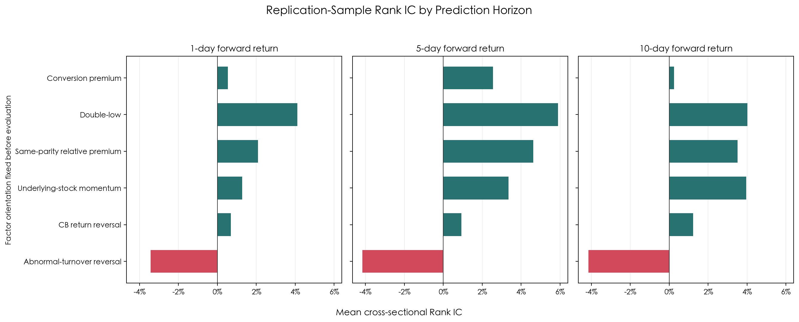
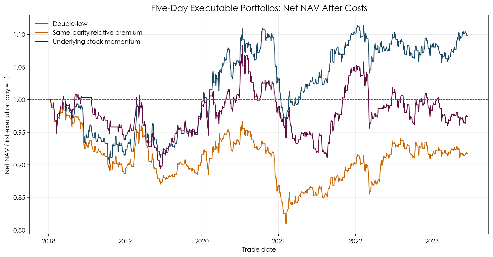
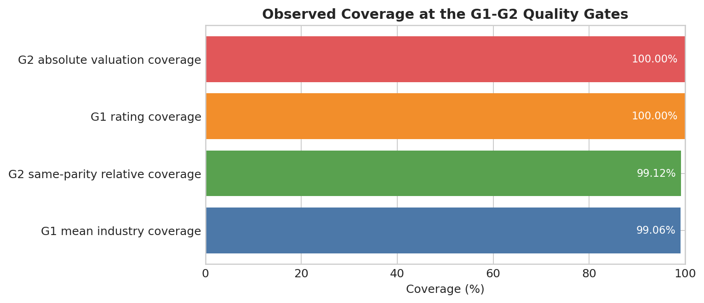
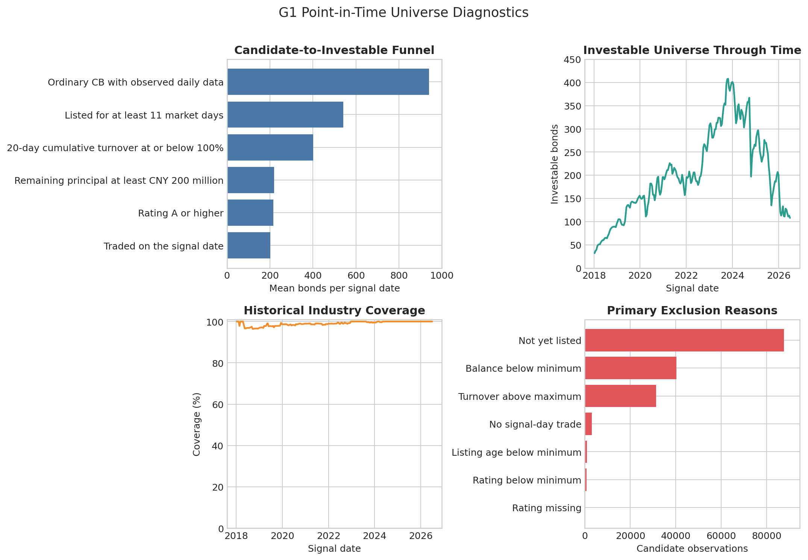
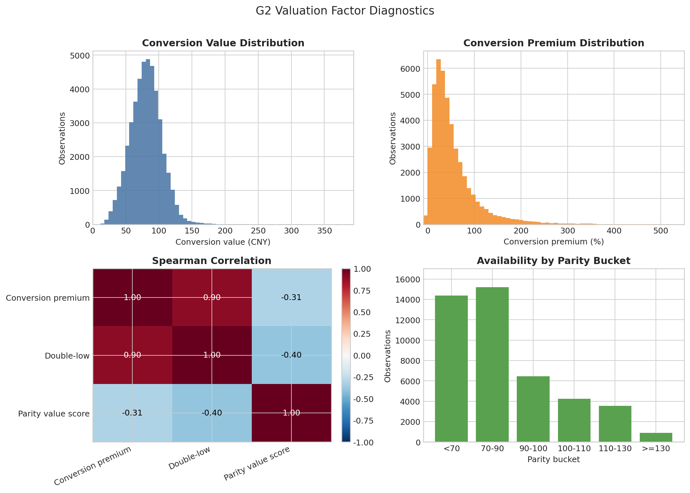
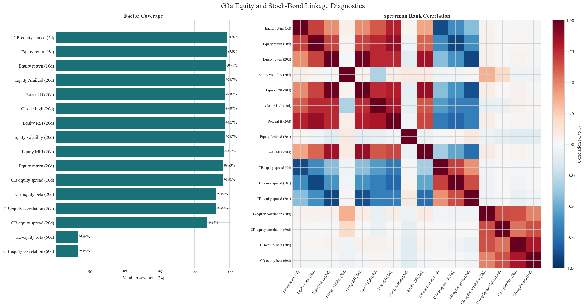
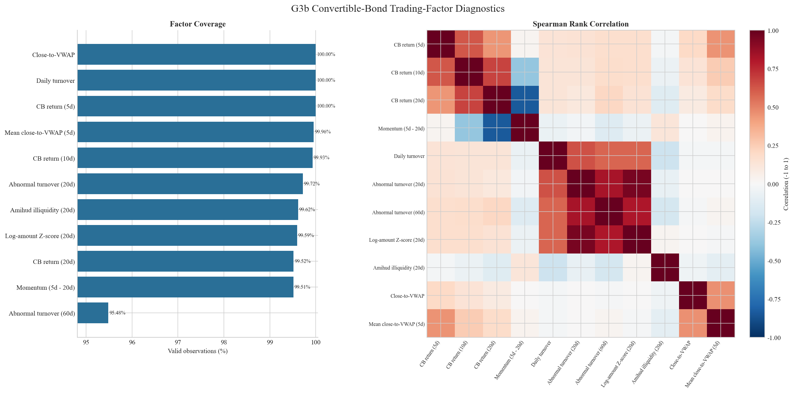

# Convertible Bond Multi-Factor Research

[](https://github.com/ddxmy/cb-multifactor/actions/workflows/ci.yml)
[](https://www.python.org/downloads/)
[](LICENSE)

A point-in-time research framework for daily-frequency Chinese convertible-bond factors.

> **Status:** G0-G2, G3a/G3b, and G4 replication inputs complete; G3c preprocessing review in progress; representative G5 and G7 evidence published
> **Sample:** 2018-2026 | **Signals:** biweekly | **Language:** Python >=3.11

## Research Objective

Chinese convertible bonds combine a bond floor, an embedded equity option, and time-varying
liquidity. This project builds an auditable cross-sectional factor pipeline around those features,
with explicit controls for information timing, universe membership, data quality, and execution
assumptions.

The current release covers factor construction, multi-horizon ranking diagnostics, and a
constraint-aware five-day portfolio checkpoint. Validation and final-holdout samples remain
locked, so the published results are research evidence rather than out-of-sample performance
claims.
Factor predictive power and strategy performance have not yet passed out-of-sample validation,
and no general return or outperformance claim is made.

## Research Design

```text
Point-in-time terms and event state
                |
                v
      Investable universe panel
                |
                v
 Valuation | Equity | Stock-bond linkage | CB trading
                |
                v
     Preprocessing and merged factor panel       G3 materialized
                |
                v
 Labels | Single-factor tests | Models | Portfolio simulation   G4 replication ready
```

The frozen specification uses a 14-calendar-day signal schedule, next-market-day-open execution,
chronological research partitions, and a final holdout beginning on 1 January 2025. The universe
requires ordinary convertible bonds with a valid signal-date observation, at least 11 market
trading days since listing, 20-day cumulative turnover no greater than 100%, remaining principal
of at least CNY 200 million, and a point-in-time rating proxy of A or above.

## Validated Scope

| Gate | Research component | Current audit evidence |
|---|---|---|
| G0 | Frozen specification | Timing, partitions, costs, and unresolved decisions validated |
| G1 | Point-in-time universe | 44,728 investable rows, 222 signal dates, 846 distinct bonds |
| G2 | Valuation factors | 100.00% absolute-valuation and 99.12% same-parity coverage |
| G3a | Equity and linkage factors | 16 factors, 95.65%-99.92% coverage, zero formula/key mismatches |
| G3b | Bond trading factors | 11 factors, 95.48%-100.00% coverage, zero formula/key mismatches |
| G4 | Replication execution inputs | Next-rebalance and 1/5/10-day O2O labels; boundary-crossing labels excluded |
| G5 | Representative single-factor evidence | Six factors tested; three pass the checkpoint medium-horizon Rank-IC screen |
| G7 | Executable five-day checkpoint | Three screened factors tested with cash, board lots, failed orders, and 15 bp one-way costs |

The G3b audit excludes one signal-date VWAP observation whose amount-volume pair implies a price
outside the recorded daily range. The remaining VWAP checks pass, and no eligible panel key is
missing or duplicated.

The first G4 materialization covers only the replication partition. It retains 23,877 signal rows,
marks 647 rows whose labels cross the partition boundary, and produces 23,171 usable next-open to
next-rebalance-open labels. Validation remains a separate research gate, and the final holdout is
locked unless explicitly released.

The same replication inputs also produce 23,537, 23,518, and 23,172 usable 1-, 5-, and
10-market-day O2O labels. These are factor-prediction horizons on the unchanged biweekly signal
calendar, not alternative portfolio-rebalancing schedules.

## Empirical Checkpoint



Double-low, same-parity relative premium, and underlying-stock 20-day momentum pass the
checkpoint medium-horizon ranking screen. The abnormal-turnover reversal hypothesis is rejected
in its pre-fixed direction and is retained as a negative result.



After cash constraints, overlapping cohorts, board-lot rounding, failed-order handling, and
15-basis-point one-way costs, only double-low remains positive in the replication sample, with a
1.84% annualized return, 0.27 Sharpe ratio, and -14.00% maximum drawdown. These results are not
validation or final-holdout estimates. See the
[replication-sample evidence](docs/methodology/empirical_results.md) for definitions, complete
tables, and interpretation.

## Research Notebooks

### G0: Data Sources and Quality

[00_data_sources_and_quality.ipynb](notebooks/00_data_sources_and_quality.ipynb)



### G1: Point-in-Time Universe

[01_point_in_time_universe.ipynb](notebooks/01_point_in_time_universe.ipynb)



### G2: Valuation Factors

[02_valuation_factors.ipynb](notebooks/02_valuation_factors.ipynb)



### G3a: Equity and Stock-Bond Linkage

[03_equity_and_linkage_factors.ipynb](notebooks/03_equity_and_linkage_factors.ipynb)



### G3b: Convertible-Bond Trading Factors

[04_cb_trading_factors.ipynb](notebooks/04_cb_trading_factors.ipynb)



### Backtest Framework Demonstration

[05_single_factor_backtest_framework.ipynb](notebooks/05_single_factor_backtest_framework.ipynb)

The bounded synthetic demonstration verifies close-signal/next-open timing, O2O labels, factor
evidence, long-only targets, blocked-order diagnostics, cash reconciliation, and daily P&L
attribution. It is an infrastructure check and does not report empirical factor performance.

### G3c: Return-Blind Factor Preprocessing

[06_factor_preprocessing.ipynb](notebooks/06_factor_preprocessing.ipynb)

The G3c notebook reconciles the merged 31-factor panel and evaluates date-local
2.5/3.0/3.5-MAD sensitivity without using forward returns. Valuation and underlying-equity
families now have explicit neutralization policies and standardized outputs; stock-bond linkage
and bond-trading policies remain under G3c-B review.

## Factor Families

- **Valuation:** conversion value, conversion premium, double-low, and same-parity relative value.
- **Underlying equity:** return, realized volatility, Relative Strength Index, Percent B, Amihud
  illiquidity, and Money Flow Index.
- **Stock-bond linkage:** return spread, rolling correlation, and rolling beta.
- **Bond trading:** return and momentum, turnover, amount surprise, Amihud illiquidity, and
  close-to-Volume-Weighted Average Price deviation.

Core calculations live in `src/cb_quant/`. Reader-facing notebooks consume materialized stage
outputs; factor definitions are not implemented only inside notebooks.

Production formulas use one explicit plugin module per factor under `src/cb_quant/factors/`.
Candidate columns in materialized research panels are not automatically production plugins. The
approved catalog can be inspected without loading market data:

```bash
PYTHONPATH=src:. python scripts/list_factors.py --format table
```

Comparable experiments are declared in `config/factor_batch_v1.json`. Factor names and
factor-specific parameters live in that file; common preprocessing, evaluation, portfolio, and
execution assumptions remain centralized in `config/backtest_v1.json`. The batch runner loads
shared histories once and writes immutable evidence packages under `artifacts/G5/factor_runs/`:

```bash
PYTHONPATH=src:. python scripts/run_factor_batch.py --help
PYTHONPATH=src:. python scripts/run_g5_multi_horizon_factor.py --factor double_low
PYTHONPATH=src:. python scripts/run_g7_fixed_horizon_portfolio.py --factor double_low
```

G4 execution inputs are materialized independently from factor evaluation. The default command
builds the replication partition and refuses to overwrite an existing evidence package:

```bash
PYTHONPATH=src:. python scripts/build_g4_inputs.py \
  --sample-partition replication_2018_2023

PYTHONPATH=src:. python scripts/build_g4_horizon_labels.py \
  --sample-partition replication_2018_2023
```

Each run receives a deterministic identity. An existing run is reused rather than overwritten,
and the cross-factor index permits comparisons only within an identical sample, universe, label,
preprocessing, portfolio, execution, and input-data fingerprint.

## Reproduction

The supported runtime is Python >=3.11. The following Conda path creates and activates an isolated
environment before invoking the interpreter:

The research commands under `scripts/` are source-checkout tools rather than installed package
entry points. Run them from the repository root so the frozen files under `config/` are available.

```bash
conda create -n cb-multifactor python=3.11 -y
conda activate cb-multifactor
python -m pip install -e ".[dev]"
python -m pytest
PYTHONPATH=src python scripts/validate_research_config.py --check-only
PYTHONPATH=src python scripts/build_g1_universe.py
PYTHONPATH=src python scripts/build_g2_valuation.py
PYTHONPATH=src python scripts/build_g3_stock_linkage.py
PYTHONPATH=src python scripts/build_g3_cb_trading.py
PYTHONPATH=src python scripts/build_g3c_preprocessing.py
PYTHONPATH=src:. python scripts/list_factors.py --format table
PYTHONPATH=src python scripts/run_single_factor.py --help
PYTHONPATH=src:. python scripts/run_factor_batch.py --help
```

The stage builders require locally configured source datasets. See the [Data contract](data/README.md)
for environment variables, source units, point-in-time event rules, and fixture policy.

## Data Boundary

The project depends on licensed or proprietary market datasets that are not redistributed. Raw
data, generated panels, audit artifacts, and local research outputs remain outside the public
release. The repository publishes schemas, formulas, validation code, compact diagnostics, and
synthetic test fixtures so the methodology can be reviewed without exposing source data.

## Methodology

- [Research decisions](docs/methodology/research_decisions.md)
- [Factor research roadmap](docs/methodology/factor_research_roadmap.md)
- [Reference-report factor map](docs/methodology/reference_report_factor_map.md)
- [Implementation stage status](docs/methodology/implementation_status.md)
- [Backtest framework](docs/methodology/backtest_framework.md)
- [Adding a factor](docs/methodology/adding_a_factor.md)
- [Replication-sample empirical results](docs/methodology/empirical_results.md)
- [Frozen research configuration](config/research_v1.json)
- [Backtest configuration](config/backtest_v1.json)
- [Factor batch configuration](config/factor_batch_v1.json)

The replication reference is Orient Securities, *An Initial Exploration of a Convertible-Bond
Multi-Factor Model*, Macro Fixed-Income Quantitative Research Series No. 10, 1 July 2023.

## Project Governance

- [MIT License](LICENSE)
- [Contribution guide](CONTRIBUTING.md)
- [Security policy](SECURITY.md)
- [Citation metadata](CITATION.cff)

Continuous integration runs the full synthetic test suite, source compilation, frozen-config
validation, dependency consistency check, and package build on Python 3.11, 3.12, and 3.13.

## Limitations

This repository is a research and reproducibility record, not investment advice. Published
performance covers only the 2018-2023 replication partition. It is not an out-of-sample claim,
does not include a selected multi-factor model, and should not be interpreted as evidence that the
same return will persist in validation, holdout, or live trading.
